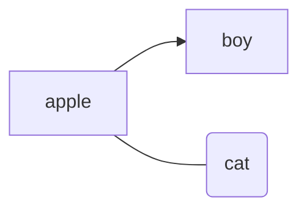

# 标题一

## 标题二  
*斜体文字*  
**加粗文字**  
***斜体加粗***  
~~删除线~~  
>引用一
>>引用二  
***    
分割线  
为什么没有分割线了呢
***  
华丽丽的分割线  
*** 

***  
再一条华丽丽的分割线  
[简书](http://jianshu.com, "一个网址")
***  
表头|表头|表头
---|:--:|---:
内111111111111111111111容|内容111|内容11111111
内容|内容|内容
***  

~~~php
```
function fun(){  
    echo "这是一句非常牛逼的代码";  
}  
fun();  
```
~~~




